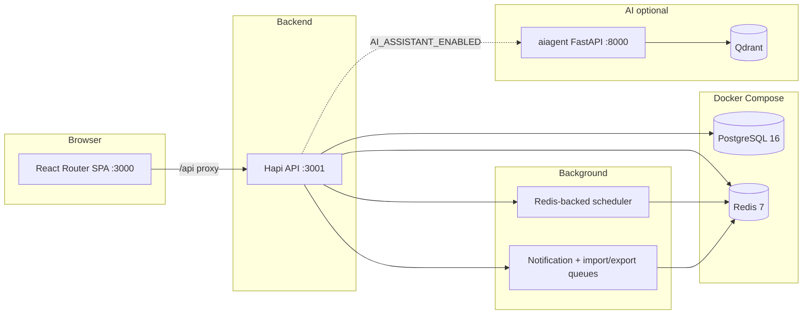

[](https://github.com/mdemou/ninjassets/actions/workflows/release.yml)
[](https://github.com/mdemou/ninjassets/actions/workflows/ci.yml)


# NinjAsset

Self-hosted IT asset management (ITAM): inventory lifecycle, sites and maps, custody via magic-link handovers and printable signed receipts, bulk assign and import/export, data-quality alerts (with dismissals), audit history, automation via API keys and webhooks / integrations, and an admin-only AI assistant (RAG over specs, docs, and OpenAPI).

## Screenshots

Captured from a local dev stack with demo data (`npm run seed:demo`).

|                       Public landing (marketing, no auth CTAs)                       |                           Sign in (`/login`)                            |
| :----------------------------------------------------------------------------------: | :---------------------------------------------------------------------: |
|  |  |

|                                                 Admin overview                                                 |                                  Asset inventory                                   |
| :------------------------------------------------------------------------------------------------------------: | :--------------------------------------------------------------------------------: |
|  |  |

|                                                     Asset detail                                                     |                                     Sites & map                                      |
| :------------------------------------------------------------------------------------------------------------------: | :----------------------------------------------------------------------------------: |
|  |  |

|                                                    Integrations (webhooks)                                                    |                                           Import & export                                           |
| :---------------------------------------------------------------------------------------------------------------------------: | :-------------------------------------------------------------------------------------------------: |
|  |  |

|                                                      Personal workspace                                                       |                                                     AI assistant (admin)                                                      |
| :---------------------------------------------------------------------------------------------------------------------------: | :---------------------------------------------------------------------------------------------------------------------------: |
|  |  |

To refresh these images after UI changes, start the app on port 3000 (with `AI_ASSISTANT_ENABLED=true` for the AI screenshot) and run `cd e2e && node scripts/capture-readme-screenshots.mjs`.

## Table of contents

- [Screenshots](#screenshots)
- [Features](#features)
- [Architecture](#architecture)
- [Tech stack](#tech-stack)
- [Prerequisites](#prerequisites)
- [Quick start](#quick-start)
- [Docker Compose](#docker-compose)
- [Development](#development)
- [Testing](#testing)
- [Documentation](#documentation)
- [Project layout](#project-layout)
- [License](#license)
- [Contributing](#contributing)

## Features

- **Asset inventory** — Lifecycle states (`STOCK`, `ASSIGNED`, `MAINTENANCE`, `ARCHIVED`), admin CRUD, and a personal read-only view for assignees. [Spec](docs/spec-asset-management.md)
- **Sites & maps** — Offices and data centers with Leaflet (OpenStreetMap); assets inherit or override coordinates. [Spec](docs/spec-site-location-management.md)
- **Verified custody** — Email magic-link handovers (recipient confirms online) and printable checkout/check-in receipts (generate PDF, collect signatures, upload scanned copy per asset). [Handover](docs/spec-handover-magic-link.md) · [Custody receipt](docs/spec-custody-receipt.md)
- **ITAM catalog** — Manufacturers, vendors, and categories with per-category custom fields. [Catalog](docs/spec-itam-catalog.md) · [Categories](docs/spec-asset-categories.md)
- **Media & QR** — Asset images, QR codes, and label printing. [Spec](docs/spec-asset-media-qr.md)
- **Data quality & alerts** — Computed hygiene rules, reports, an admin notification bell, and signature-based dismissals (discard/undo on overview and bell without editing assets). [Spec](docs/spec-data-quality-and-alerts.md)
- **Bulk assign** — Multi-asset checkout/return from the assets list (direct or verified handover per asset) plus batch custody PDF. [Spec](docs/spec-bulk-assign.md)
- **Audit history** — Admin-wide transaction log and per-user “My History”. [Spec](docs/spec-dashboards-and-audit-history.md)
- **Dashboards** — Admin overview (KPIs, charts, map) and a personal workspace. [Admin](docs/spec-dashboards-and-audit-history.md) · [Personal](docs/spec-personal-workspace.md)
- **API automation** — Bearer API keys for machine access to admin endpoints. [Spec](docs/spec-api-automation.md)
- **Webhooks / Integrations** — Slack, Discord, and Telegram destinations on domain events. [Spec](docs/spec-webhooks-notifications.md)
- **Bulk import/export** — Admin hub (`/admin/import-export`) to migrate or export assets, sites, users, and catalog via CSV/XLSX/JSON with column mapping, a mandatory dry-run, and async jobs. [Spec](docs/spec-import-export.md)
- **AI assistant** — Admin-only RAG chat (`/admin/ai`): streamed answers about features, workflows, configuration, and the HTTP API, with source citations and EN/ES UI. Backend proxies to the stateless `aiagent` service (Qdrant + embeddings + LLM). [Spec](docs/spec-ai-assistant.md)
- **Public landing & docs** — Marketing page at `/` (no API calls, no login/signup links); in-app docs at `/docs`; authentication at `/login` and `/register`. [Landing](docs/spec-public-landing.md) · [Auth](docs/spec-authentication.md)
- **Auth & profile** — Registration, email verification, password reset, lockout, settings, EN/ES UI. Admins can set another user's password from the user directory. [Auth](docs/spec-authentication.md) · [Profile](docs/spec-profile-settings.md) · [Users](docs/spec-admin-user-management.md)

## Architecture



Admin routes use `/api/p/*`; personal routes use `/api/me/*` (see [platform access model](docs/spec-platform-access-model.md)).

## Tech stack

| Layer                | Technologies                                                                                                                                                                                  |
| -------------------- | --------------------------------------------------------------------------------------------------------------------------------------------------------------------------------------------- |
| Frontend             | React 19, React Router 7 (SPA), Tailwind CSS v4, Leaflet, Recharts                                                                                                                            |
| Backend              | Node.js, Hapi, Knex, PostgreSQL                                                                                                                                                               |
| AI assistant         | Python FastAPI (`aiagent`), LangChain + Qdrant + Grok/xAI (configurable), CPU embeddings (`multilingual-e5-base`)                                                                             |
| Jobs & notifications | Redis queues (webhooks, email, import/export wakeups) plus a Redis-backed periodic scheduler (token cleanup, API log retention, notification reaper, webhook alert scan, import/export sweep) |
| Tests                | Playwright (isolated stack on ports 4000/4001)                                                                                                                                                |

## Prerequisites

- **Node.js** 20+
- **npm**
- **Docker** (recommended for PostgreSQL and Redis)

## Quick start

Local development with hot reload (API and web app run on the host; only PostgreSQL and Redis run in Docker).

1. Copy environment defaults and start infrastructure:

```bash
cp backend/.env.example backend/.env
docker compose --env-file backend/.env up -d postgres redis-server qdrant
```

Redis backs webhooks, email jobs, the periodic maintenance scheduler, and optional import/export job wakeups. Qdrant is only needed when running the AI assistant locally (see [aiagent/README.md](aiagent/README.md)).

2. Run the API (from a new terminal):

```bash
cd backend
npm install
npm run migrate
npm run dev
```

API: **[http://localhost:3001](http://localhost:3001)**

3. Run the web app:

```bash
cd frontend
npm install
npm run dev
```

App: **[http://localhost:3000](http://localhost:3000)**

Optional seed data: `cd backend && npm run seed` (append-only). For a full reset plus richer demo data: `npm run seed:demo`.

## Docker Compose

Run the full stack from published images: PostgreSQL, Redis, Qdrant, **aiagent** (AI RAG service), backend API, and nginx frontend.

| Service | Image | Notes |
| --- | --- | --- |
| `postgres`, `redis-server` | Official images | Same as local dev |
| `qdrant` | `qdrant/qdrant` | Vector store for the assistant |
| `aiagent` | `ghcr.io/<owner>/ninjasset-aiagent` | ~2 GB image (deps only); embedding model via volume |
| `backend`, `frontend` | `ghcr.io/<owner>/ninjasset-{backend,frontend}` | API + SPA |

1. Create env files:

```bash
cp backend/.env.example backend/.env
cp aiagent/.env.example aiagent/.env
```

Edit `backend/.env` before starting. At minimum, set strong values for `JWT_ADMIN_SECRET_KEY` and `JWT_USER_SECRET_KEY`. Keep `REDIS_PASSWORD` in sync with the password configured for the `redis-server` service in `docker-compose.yml` (default `your_secure_password`).

For the AI assistant, set in `backend/.env`:

- `AI_ASSISTANT_ENABLED=true`
- `AI_AGENT_API_KEY` — shared secret (same value in `aiagent/.env`)

Set in `aiagent/.env`:

- `GROK_API_KEY` — LLM provider key
- `AI_AGENT_API_KEY` — must match the backend

Compose overrides container networking — you do **not** need to set these manually in `backend/.env`:

| Variable | Value inside Compose |
| --- | --- |
| `DB_HOST` | `postgres` |
| `REDIS_HOST` | `redis-server` |
| `DATABASE_URL` | `postgres://<DB_USER>:<DB_PASSWORD>@postgres:5432/<DB_NAME>` |
| `AI_AGENT_URL` | `http://aiagent:8000` |
| `QDRANT_URL` (aiagent) | `http://qdrant:6333` |

**Embedding model volume:** the aiagent image does not include the ~1.1 GB Hugging Face weights. By default, Compose bind-mounts your host cache:

```env
# optional — defaults to ~/.cache/huggingface
HF_CACHE_DIR=/Users/you/.cache/huggingface
```

First aiagent start with an empty cache downloads the model (several minutes; healthcheck allows up to 5 minutes).

2. Pull images and start all services:

```bash
docker compose --env-file backend/.env pull
docker compose --env-file backend/.env up -d
```

- **App:** [http://localhost:3000](http://localhost:3000) — nginx serves the SPA and proxies `/api/` to the backend
- **API (direct):** [http://localhost:3001](http://localhost:3001)
- **aiagent (internal):** [http://localhost:8000](http://localhost:8000) — backend proxy only; do not expose publicly in production

The backend image runs Knex migrations on startup. Named volumes persist PostgreSQL data, Qdrant vectors, backend uploads, and (optionally) the HF cache if you switch from a bind mount to a named volume.

3. After a new release (version tag on GitHub), refresh images:

```bash
docker compose --env-file backend/.env pull
docker compose --env-file backend/.env up -d
```

Images (`ninjasset-backend`, `ninjasset-frontend`, `ninjasset-aiagent`) are published to GitHub Container Registry on version tags (`v*`). If the packages are private, log in first: `docker login ghcr.io`.

To run only infrastructure while developing on the host, use [Quick start](#quick-start) (`docker compose --env-file backend/.env up -d postgres redis-server qdrant`).

## Development

Environment variables are split per service:

| File | Purpose |
| --- | --- |
| `backend/.env` | API, Knex migrations, Docker Compose (`--env-file backend/.env`) |
| `aiagent/.env` | AI service (Qdrant, embeddings, LLM, PII anonymization) — see [aiagent/README.md](aiagent/README.md) |
| `e2e/.env` | Playwright tests (PostgreSQL + Redis connection only) |
| `frontend/.env` | Optional dev-server overrides (`PORT`, `API_URL`) |

| Variable                                                                                                   | Purpose                                                                                                    |
| ---------------------------------------------------------------------------------------------------------- | ---------------------------------------------------------------------------------------------------------- |
| `DATABASE_URL` / `DB_*`                                                                                    | PostgreSQL connection                                                                                      |
| `JWT_ADMIN_SECRET_KEY`, `JWT_USER_SECRET_KEY`                                                              | Auth tokens                                                                                                |
| `FRONTEND_URL`                                                                                             | Links in emails (handovers, verification)                                                                  |
| `REDIS_*`                                                                                                  | Webhooks, email, import/export queue, scheduler state (last-run timestamps + locks)                        |
| `MAINTENANCE_*`, `TOKEN_CLEANUP_*`, `API_RETENTION_*`, `IMPORT_ARTIFACT_PURGE_*`, `IMPORT_SAFETY_SWEEP_MS` | Periodic maintenance cadences ([health/ops spec](docs/spec-health-operations.md))                          |
| `IMPORT_*`, `IMPORT_EXPORT_*`                                                                              | Bulk import/export limits, storage, worker, optional completion email ([spec](docs/spec-import-export.md)) |
| `WEBHOOK_ALERT_SCAN_INTERVAL_MS`                                                                           | How often the API scans for new data-quality issues to emit `alert.raised` webhook events                  |
| `SIGNUP_ENABLED`                                                                                           | When `false`, disables registration API and UI (`GET /api/session/public-config`)                          |
| `MOCK_CAPTCHA`, `MOCK_EMAIL`                                                                               | Simpler local testing (log mail to console when `SMTP_HOST` is empty)                                      |
| `HANDOVER_TOKEN_EXPIRY_HOURS`                                                                              | Magic-link TTL (default 72)                                                                                |
| `AI_ASSISTANT_ENABLED`, `MOCK_AI`, `AI_AGENT_URL`, `AI_AGENT_API_KEY`                                      | Admin AI assistant feature flag, E2E mock, and aiagent proxy ([spec](docs/spec-ai-assistant.md))           |

Layer-specific guides:

- [Backend README](backend/README.md) — API structure, migrations, layering, background jobs
- [Frontend README](frontend/README.md) — SPA routes, providers, components
- [aiagent README](aiagent/README.md) — RAG service, Qdrant corpus, reindex, local run

Production-style runs: `npm run build && npm start` in each package after setting `NODE_ENV` and production secrets.

## Testing

End-to-end tests use Playwright against an **isolated** stack (frontend `:4000`, backend `:4001`, database `ninjasset_test`) so development data is never touched.

```bash
cd e2e
npm install
npm run install:browsers
npm run test:agent
```

Details: [E2E testing guide](docs/e2e-testing.md) · [e2e/README.md](e2e/README.md)

## Documentation

Specifications, E2E conventions, and feature design notes live in **[docs/](docs/)**.

| Resource                                                                   | Description                                 |
| -------------------------------------------------------------------------- | ------------------------------------------- |
| [docs/spec-index.md](docs/spec-index.md)                                   | Registry of all feature specs (start here)  |
| [docs/e2e-testing.md](docs/e2e-testing.md)                                 | Test stack, agents, and requirement linking |
| [docs/spec-api-automation.md](docs/spec-api-automation.md)                 | API keys and machine access                 |
| [docs/spec-import-export.md](docs/spec-import-export.md)                   | Bulk import/export hub and job API          |
| [docs/spec-health-operations.md](docs/spec-health-operations.md)           | Health checks and periodic maintenance jobs |
| [docs/spec-bulk-assign.md](docs/spec-bulk-assign.md)                       | Multi-asset checkout/return wizard          |
| [backend/docs/backend-layering.md](backend/docs/backend-layering.md)       | Backend architecture conventions            |
| [backend/docs/database-migrations.md](backend/docs/database-migrations.md) | Schema migrations                           |

## Project layout

```
ninjasset/
├── frontend/     # React Router SPA
├── backend/      # Hapi API, Knex, domains
├── aiagent/      # Admin AI assistant (RAG service)
├── e2e/          # Playwright tests
├── docs/         # Feature specs and guides
└── docker-compose.yml
```

## License

[MIT](LICENSE) — Copyright (c) 2026 Javier Moure. Free to use, modify, and distribute; keep the copyright and license notice when you share copies.

## Contributing

Contributions are welcome. See [CONTRIBUTING.md](CONTRIBUTING.md) for setup, specs, tests, and pull request guidelines.
