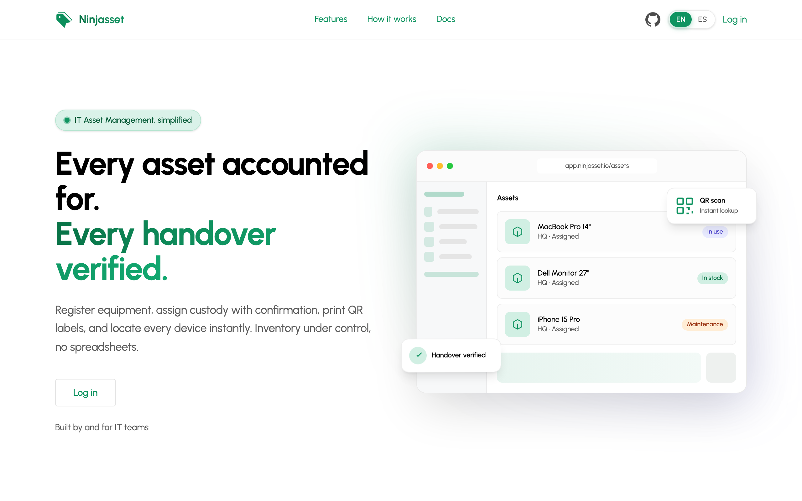
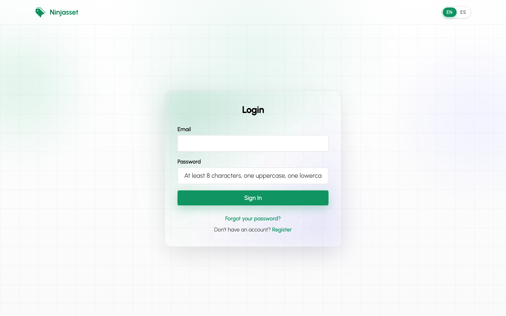
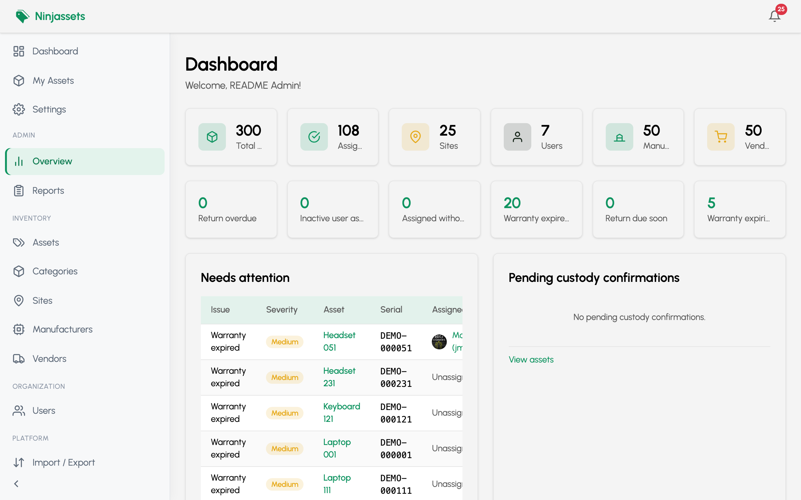
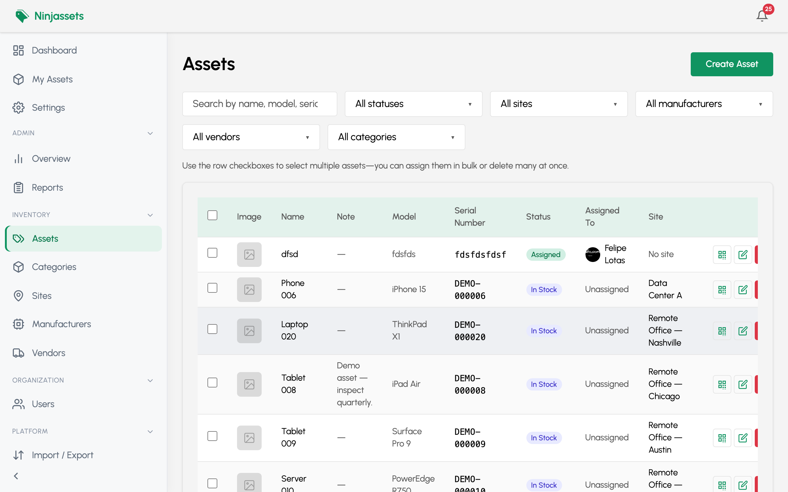
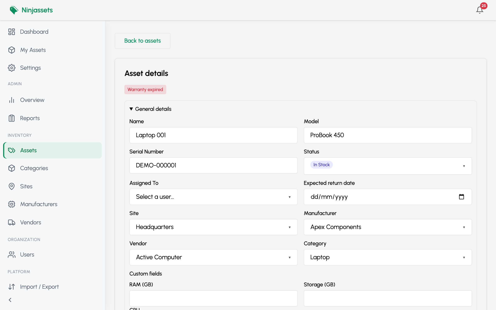
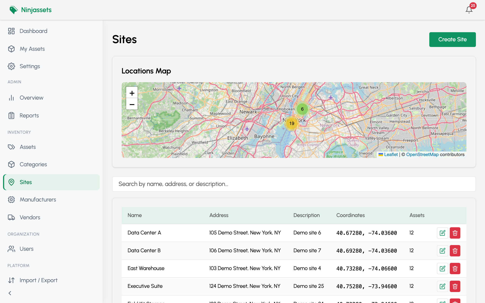
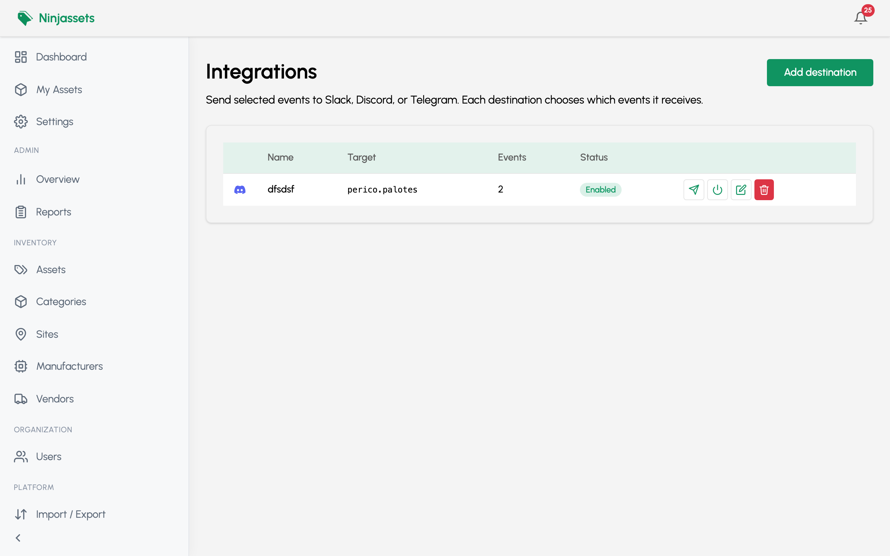
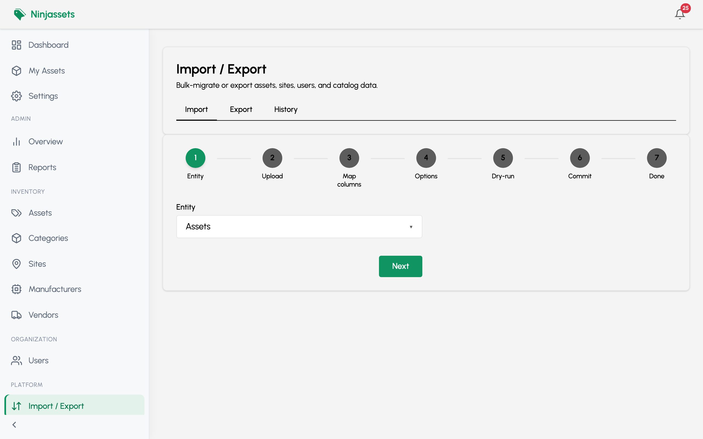
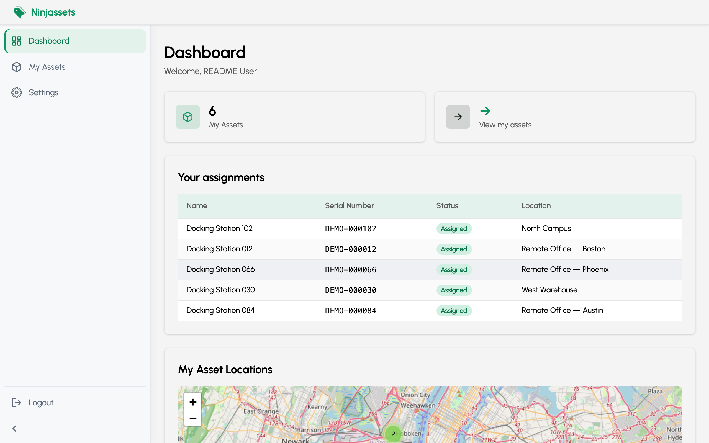
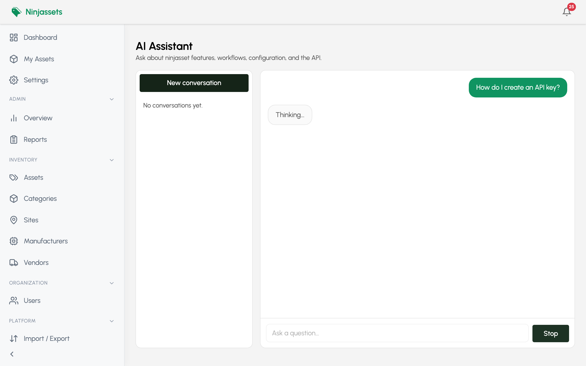

[](https://github.com/mdemou/ninjassets/actions/workflows/release.yml)
[](https://github.com/mdemou/ninjassets/actions/workflows/ci.yml)


# NinjAsset

Self-hosted IT asset management (ITAM): inventory lifecycle, sites and maps, custody via magic-link handovers and printable signed receipts, bulk assign and import/export, data-quality alerts (with dismissals), audit history, automation via API keys and webhooks / integrations, and an admin-only AI assistant (RAG over specs, docs, and OpenAPI).

## Screenshots

Captured from a local dev stack with demo data (`npm run seed:demo`).

|                       Public landing (marketing, no auth CTAs)                       |                           Sign in (`/login`)                            |
| :----------------------------------------------------------------------------------: | :---------------------------------------------------------------------: |
|  |  |

|                                                 Admin overview                                                 |                                  Asset inventory                                   |
| :------------------------------------------------------------------------------------------------------------: | :--------------------------------------------------------------------------------: |
|  |  |

|                                                     Asset detail                                                     |                                     Sites & map                                      |
| :------------------------------------------------------------------------------------------------------------------: | :----------------------------------------------------------------------------------: |
|  |  |

|                                                    Integrations (webhooks)                                                    |                                           Import & export                                           |
| :---------------------------------------------------------------------------------------------------------------------------: | :-------------------------------------------------------------------------------------------------: |
|  |  |

|                                                      Personal workspace                                                       |                                                     AI assistant (admin)                                                      |
| :---------------------------------------------------------------------------------------------------------------------------: | :---------------------------------------------------------------------------------------------------------------------------: |
|  |  |

To refresh these images after UI changes, start the app on port 3000 (with `AI_ASSISTANT_ENABLED=true` for the AI screenshot) and run `cd e2e && node scripts/capture-readme-screenshots.mjs`.

## Table of contents

- [Screenshots](#screenshots)
- [Features](#features)
- [Tech stack](#tech-stack)
- [Prerequisites](#prerequisites)
- [Quick start](#quick-start)
- [Docker Compose](#docker-compose)
- [Testing](#testing)
- [Documentation](#documentation)
- [Project layout](#project-layout)
- [License](#license)
- [Contributing](#contributing)

## Features

- **Asset inventory** — Lifecycle states (`STOCK`, `ASSIGNED`, `MAINTENANCE`, `ARCHIVED`), admin CRUD, and a personal read-only view for assignees. [Spec](docs/spec-asset-management.md)
- **Sites & maps** — Offices and data centers with Leaflet (OpenStreetMap); assets inherit or override coordinates. [Spec](docs/spec-site-location-management.md)
- **Verified custody** — Email magic-link handovers (recipient confirms online) and printable checkout/check-in receipts (generate PDF, collect signatures, upload scanned copy per asset). [Handover](docs/spec-handover-magic-link.md) · [Custody receipt](docs/spec-custody-receipt.md)
- **ITAM catalog** — Manufacturers, vendors, and categories with per-category custom fields. [Catalog](docs/spec-itam-catalog.md) · [Categories](docs/spec-asset-categories.md)
- **Media & QR** — Asset images, QR codes, and label printing. [Spec](docs/spec-asset-media-qr.md)
- **Data quality & alerts** — Computed hygiene rules, reports, an admin notification bell, and signature-based dismissals (discard/undo on overview and bell without editing assets). [Spec](docs/spec-data-quality-and-alerts.md)
- **Bulk assign** — Multi-asset checkout/return from the assets list (direct or verified handover per asset) plus batch custody PDF. [Spec](docs/spec-bulk-assign.md)
- **Audit history** — Admin-wide transaction log and per-user “My History”. [Spec](docs/spec-dashboards-and-audit-history.md)
- **Dashboards** — Admin overview (KPIs, charts, map) and a personal workspace. [Admin](docs/spec-dashboards-and-audit-history.md) · [Personal](docs/spec-personal-workspace.md)
- **API automation** — Bearer API keys for machine access to admin endpoints. [Spec](docs/spec-api-automation.md)
- **Webhooks / Integrations** — Slack, Discord, and Telegram destinations on domain events. [Spec](docs/spec-webhooks-notifications.md)
- **Bulk import/export** — Admin hub (`/admin/import-export`) to migrate or export assets, sites, users, and catalog via CSV/XLSX/JSON with column mapping, a mandatory dry-run, and async jobs. [Spec](docs/spec-import-export.md)
- **AI assistant** — Admin-only RAG chat (`/admin/ai`): streamed answers about features, workflows, configuration, and the HTTP API, with source citations and EN/ES UI. Backend proxies to the stateless `aiagent` service (Qdrant + embeddings + LLM). [Spec](docs/spec-ai-assistant.md)
- **Public landing & docs** — Marketing page at `/` (no API calls, no login/signup links); in-app docs at `/docs`; authentication at `/login` and `/register`. [Landing](docs/spec-public-landing.md) · [Auth](docs/spec-authentication.md)
- **Auth & profile** — Registration, email verification, password reset, lockout, settings, EN/ES UI. Admins can set another user's password from the user directory. [Auth](docs/spec-authentication.md) · [Profile](docs/spec-profile-settings.md) · [Users](docs/spec-admin-user-management.md)

## Tech stack

| Layer                | Technologies                                                                                                                                                                                  |
| -------------------- | --------------------------------------------------------------------------------------------------------------------------------------------------------------------------------------------- |
| Frontend             | React 19, React Router 7 (SPA), Tailwind CSS v4, Leaflet, Recharts                                                                                                                            |
| Backend              | Node.js, Hapi, Knex, PostgreSQL                                                                                                                                                               |
| AI assistant         | Python FastAPI (`aiagent`), LangChain + Qdrant + Grok/xAI (configurable), CPU embeddings (`multilingual-e5-base`)                                                                             |
| Jobs & notifications | Redis queues (webhooks, email, import/export wakeups) plus a Redis-backed periodic scheduler (token cleanup, API log retention, notification reaper, webhook alert scan, import/export sweep) |
| Tests                | Playwright (isolated stack on ports 4000/4001)                                                                                                                                                |

## Prerequisites

- **Docker** and Docker Compose

## Quick start

1. Copy the example env files (backend **and** aiagent) and edit values as needed:

```bash
cp backend/.env.example backend/.env
cp aiagent/.env.example aiagent/.env
```

At minimum, set strong `JWT_ADMIN_SECRET_KEY` and `JWT_USER_SECRET_KEY` in `backend/.env`. Keep `REDIS_PASSWORD` in sync with `docker-compose.yml` (default `your_secure_password`). For the AI assistant, set `AI_ASSISTANT_ENABLED=true`, `GROK_API_KEY`, and matching `AI_AGENT_API_KEY` in both env files — see [Docker Compose](#docker-compose) for details.

2. Start the stack:

```bash
docker compose -f docker-compose.yml up
```

- **App:** [http://localhost:3000](http://localhost:3000)
- **API (direct):** [http://localhost:3001](http://localhost:3001)

The backend image runs migrations on startup. Add `-d` to run detached.

3. If you enabled the AI assistant, populate Qdrant from this repo checkout (once, or after editing specs/docs/API):

```bash
cd aiagent
uv sync
uv run python -m ai_service.jobs.reindex
```

`aiagent/.env` should use `QDRANT_URL=http://localhost:6333` (the default in `.env.example`). Details: [aiagent/README.md — Reindex](aiagent/README.md#reindex).

## Docker Compose

Full stack from published images: PostgreSQL, Redis, Qdrant, **aiagent** (AI RAG service), backend API, and nginx frontend.

| Service | Image | Notes |
| --- | --- | --- |
| `postgres`, `redis-server` | Official images | Data store and job queues |
| `qdrant` | `qdrant/qdrant` | Vector store for the assistant |
| `aiagent` | `ghcr.io/<owner>/ninjasset-aiagent` | ~2 GB image (deps only); embedding model via volume |
| `backend`, `frontend` | `ghcr.io/<owner>/ninjasset-{backend,frontend}` | API + SPA |

Compose overrides container networking — you do **not** need to set these manually in `backend/.env`:

| Variable | Value inside Compose |
| --- | --- |
| `DB_HOST` | `postgres` |
| `REDIS_HOST` | `redis-server` |
| `DATABASE_URL` | `postgres://<DB_USER>:<DB_PASSWORD>@postgres:5432/<DB_NAME>` |
| `AI_AGENT_URL` | `http://aiagent:8000` |
| `QDRANT_URL` (aiagent) | `http://qdrant:6333` |

**Embedding model volume:** the aiagent image does not include the ~1.1 GB Hugging Face weights (`intfloat/multilingual-e5-base`). Compose bind-mounts a host cache into the container (`HF_HOME=/models/hf`); default host path is `~/.cache/huggingface`. Override with `HF_CACHE_DIR` in a root `.env` file.

Pre-download on the host (optional — same path the container uses, faster first start):

```bash
cd aiagent
uv sync
uv run python -c "from sentence_transformers import SentenceTransformer; SentenceTransformer('intfloat/multilingual-e5-base')"
```

If the cache directory is missing or empty, `entrypoint.sh` downloads the model on first container start (several minutes; healthcheck `start_period` allows up to 5 minutes). Later starts reuse the mounted cache.

Named volumes persist PostgreSQL data, Qdrant vectors, and backend uploads.

After a new release (version tag on GitHub), refresh images:

```bash
docker compose -f docker-compose.yml pull
docker compose -f docker-compose.yml up -d
```

Images (`ninjasset-backend`, `ninjasset-frontend`, `ninjasset-aiagent`) are published to GitHub Container Registry on version tags (`v*`). If the packages are private, log in first: `docker login ghcr.io`.

## Testing

End-to-end tests use Playwright against an **isolated** stack (frontend `:4000`, backend `:4001`, database `ninjasset_test`) so development data is never touched.

```bash
cd e2e
npm install
npm run install:browsers
npm run test:agent
```

Details: [E2E testing guide](docs/e2e-testing.md) · [e2e/README.md](e2e/README.md)

## Documentation

Specifications, E2E conventions, and feature design notes live in **[docs/](docs/)**.

| Resource                                                                   | Description                                 |
| -------------------------------------------------------------------------- | ------------------------------------------- |
| [docs/spec-index.md](docs/spec-index.md)                                   | Registry of all feature specs (start here)  |
| [docs/e2e-testing.md](docs/e2e-testing.md)                                 | Test stack, agents, and requirement linking |
| [docs/spec-api-automation.md](docs/spec-api-automation.md)                 | API keys and machine access                 |
| [docs/spec-import-export.md](docs/spec-import-export.md)                   | Bulk import/export hub and job API          |
| [docs/spec-health-operations.md](docs/spec-health-operations.md)           | Health checks and periodic maintenance jobs |
| [docs/spec-bulk-assign.md](docs/spec-bulk-assign.md)                       | Multi-asset checkout/return wizard          |
| [backend/docs/backend-layering.md](backend/docs/backend-layering.md)       | Backend architecture conventions            |
| [backend/docs/database-migrations.md](backend/docs/database-migrations.md) | Schema migrations                           |

## Project layout

```
ninjasset/
├── frontend/     # React Router SPA
├── backend/      # Hapi API, Knex, domains
├── aiagent/      # Admin AI assistant (RAG service)
├── e2e/          # Playwright tests
├── docs/         # Feature specs and guides
└── docker-compose.yml
```

## License

[MIT](LICENSE) — Copyright (c) 2026 Javier Moure. Free to use, modify, and distribute; keep the copyright and license notice when you share copies.

## Contributing

Contributions are welcome. See [CONTRIBUTING.md](CONTRIBUTING.md) for setup, specs, tests, and pull request guidelines.
